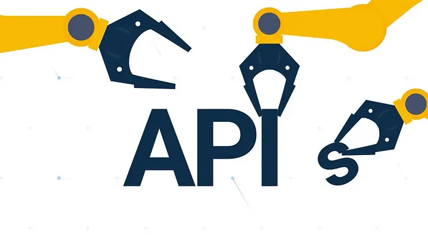
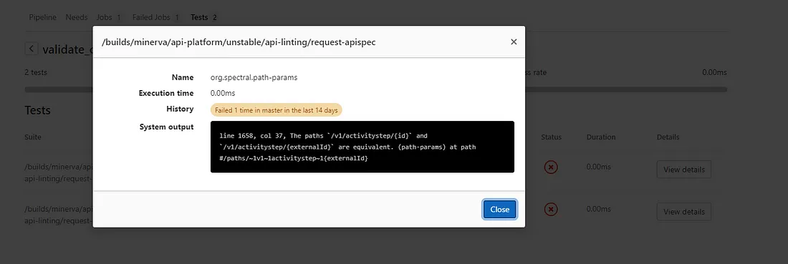

# Your code-first API needs validation



When you start a project you might tend to do code first API as this is a well-known territory for most developers, especially with frameworks like Spring Boot which use powerful annotations to generate your API and specifications.

In a matter of a few lines, you have a simple CRUD API up and running. But that’s not the end of the story, people need to consume it next. And as they are looking at consuming your API the first thing they will turn to is your documentation, specification, and associated testing UI.

You would think that the code-first approach and auto-generation of your OpenAPI specification got you covered. Sadly most of the time your specification will be invalid.

The root cause for your invalid specs is usually quite simple, the OpenAPI schema validation was not implemented in the annotation you use in your code. In itself, the invalid schema won’t prevent you from serving and consuming the API but it will prevent you from using the whole set of open source tools that are relying on it like the one in this collection of links: [OpenApi Tools](https://openapi.tools/)


To cope with the situation I propose to introduce you to a very handy tool called spectral [Spectral](https://stoplight.io/open-source/spectral/)

## Generating OpenAPI specs at build time
Before jumping into validation of your API specs the first thing you need to do in code first is to grasp a copy of the spec which is usually only exposed while running your project. To do so I propose for those of you using Java and spring boot a simple build plugin using springdoc [Springdoc](https://springdoc.org/)

``` xml
...
<build>
    <plugins>
        ...

        <plugin>
            <groupId>org.springframework.boot</groupId>
            <artifactId>spring-boot-maven-plugin</artifactId>
            <version>VERSION HERE</version>
            <configuration>
                <wait>2000</wait>
                <jvmArguments>-Dspring.application.admin.enabled=true</jvmArguments>
            </configuration>
            <executions>
                <execution>
                    <id>pre-integration-test</id>
                    <goals>
                        <goal>start</goal>
                    </goals>
                </execution>
                <execution>
                    <id>post-integration-test</id>
                    <goals>
                        <goal>stop</goal>
                    </goals>
                </execution>
            </executions>
        </plugin>
        <plugin>
            <groupId>org.springdoc</groupId>
            <artifactId>springdoc-openapi-maven-plugin</artifactId>
            <version>VERSION HERE</version>
            <executions>
                <execution>
                    <id>integration-test</id>
                    <goals>
                        <goal>generate</goal>
                    </goals>
                </execution>
            </executions>
            <configuration>
                <apiDocsUrl>http://localhost:8080/api-docs</apiDocsUrl>
                <outputFileName>openapi.json</outputFileName>
                <outputDir>${project.build.directory}</outputDir>
                <skip>false</skip>
            </configuration>
        </plugin>
    </plugins>
...
</build>
```


## CI validation
Once you have managed to generate an OpenApi spec out of your code-first API it is time to validate it using spectral. Spectral contains out-of-the-box an OpenApi schema validator and is able to parse JSON or YAML all the same.

Spotlight provides a container image with spectral installed and all required dependency which allows for a very straightforward gitlab-ci definition of the validation step.

``` yaml
stages:
  - validate

validate_open-api:
  stage: validate
  image:
    name: stoplight/spectral
    entrypoint: [""]
  script:
    - spectral lint request-apispec.json -f junit -o api-report.xml
  artifacts:
    when: always
    paths:
      - api-report.xml
    reports:
      junit: api-report.xml
```

What you want to note here except for the regular calls to spectral lint is the usage of the JUnit format and output to an XML file. The file is later reused as a report so you can visualize the linter output in a nicer way.





## Creating a custom rule
The power of spectral lies in its rulesets, they provide you with the basic set of rules to be applied to your document. But if you want to go further spectral allows you to extend and even override those rulesets [Rulesets](https://meta.stoplight.io/docs/spectral/docs/guides/4-custom-rulesets.md)

To illustrate the kind of extra rules you might want to implement here is a simple rule to check you are only using HTTPS endpoints.

``` yaml
extends: spectral:oas
rules:
   endpoint-should-be-https:
    description: Endpoints should be using https
    given: $.servers[*]
    severity: error
    then:
      field: url
      function: pattern
      functionOptions:
        match: "^https"
```


## What are the next steps ?
If you want to go further I would suggest some deep dive in the spectral documentation: [Spectral Documentation](https://meta.stoplight.io/docs/spectral/docs/getting-started/1-concepts.md)

Have a look at this great article from Joyce Lin: [Joyce Lin](https://medium.com/better-practices/api-specifications-d87588ac874)

I would check out how you can enable local build OpenAPI specification validation using spectral in your build scripts

Then maybe you could reflect on having common API specification rules for your company?

What would you do next?