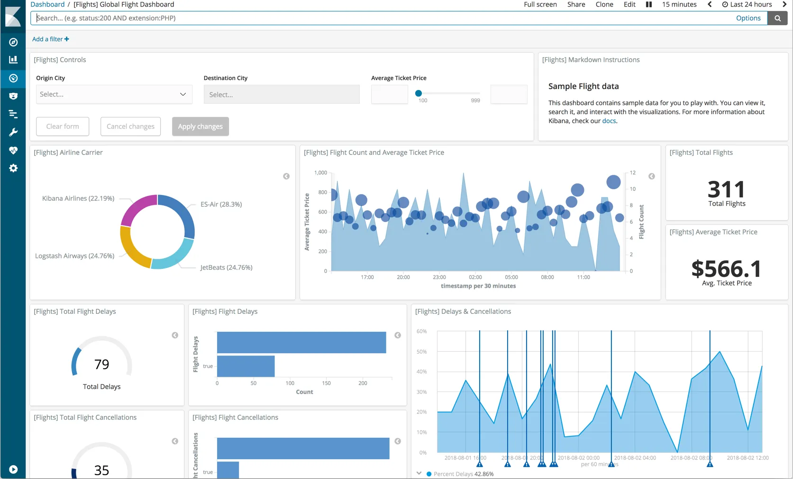
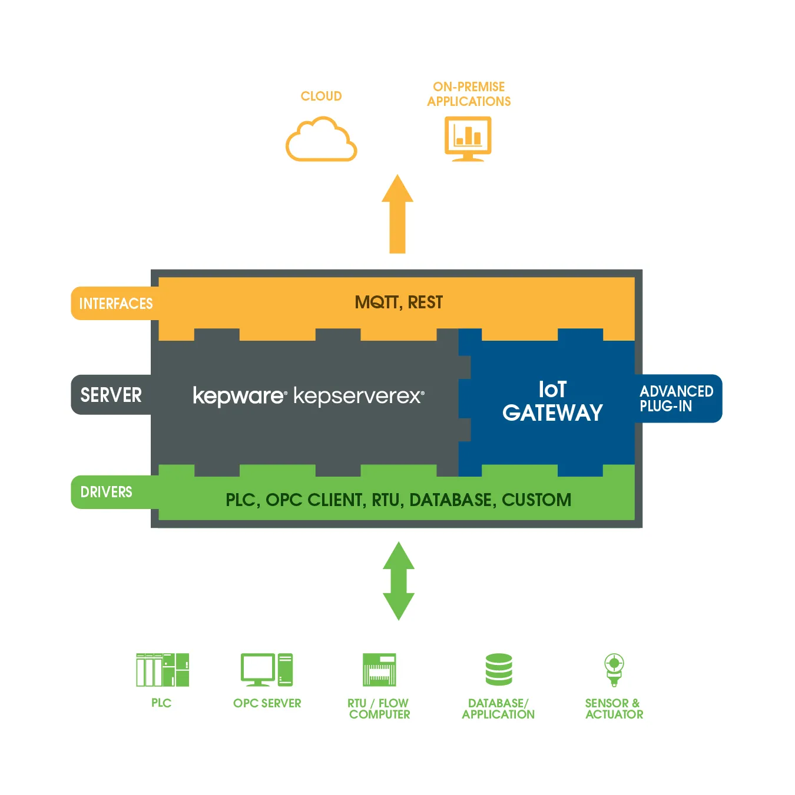
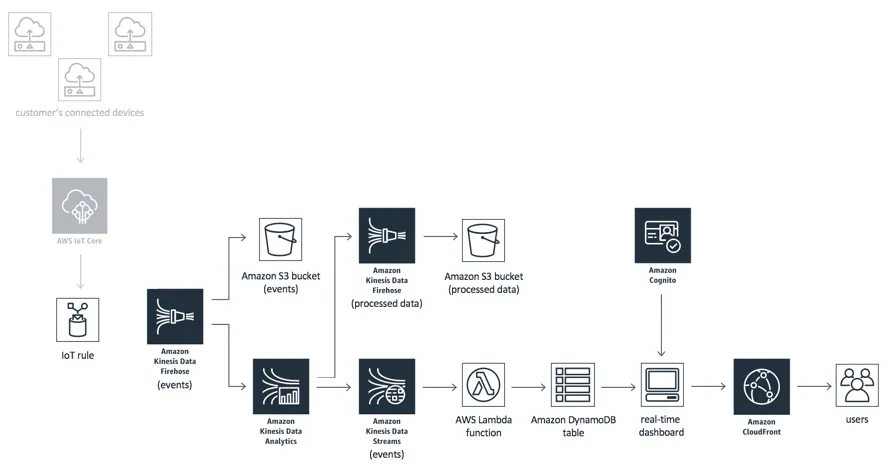
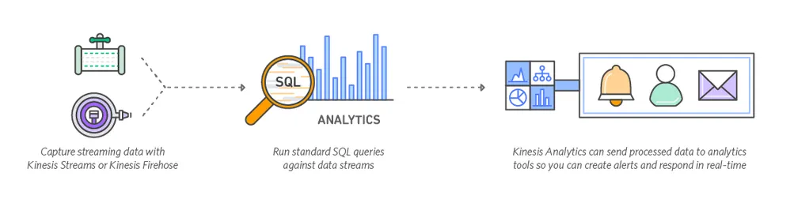
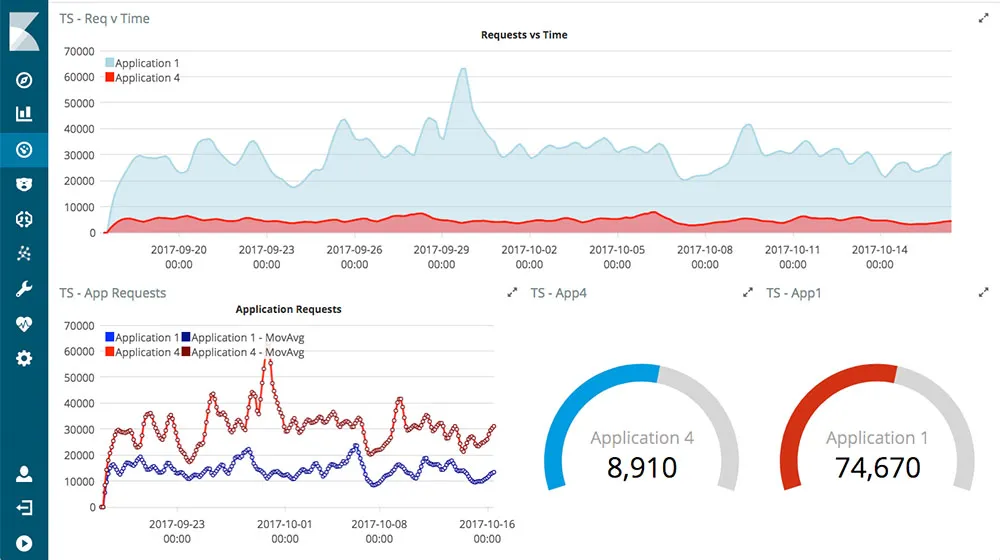
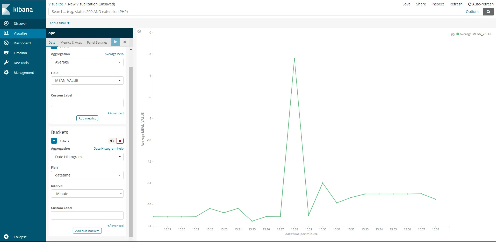

# Real-time OPC-UA tags monitoring in the cloud with AWS IoT

Wouldn’t it be nice to see your field data in (near) real-time? To be able to build a powerful dashboard in a matter of minutes to monitor your process, or start digitizing your visual management practices.

       

We all have of favorite OPC server depending on the task, but for me it is Kepware. The nice thing about OPC servers is usually that they cover way more communication protocols and allow us to connect to otherwise non-OPC compatible machines.

<!-- more -->

Now with all these collecting capabilities, we need to be able to store, analyze, and display such data. There is of course some powerful tool to do this such as historians like Osi Pi, but what would be nice is if we could set up as scalable solution within minutes with unlimited integration and that’s where cloud solution comes handy.

Luckily for us, Kepware got us covered and is already providing an IoT Gateway that will allow us to choose tag which should be forwarded to the cloud.

It’s one thing to be able to send data to the cloud in near real-time but what’s important is the ability to do stream processing of these data.

What is stream processing? Well it’s the inverse of you regular report generation that is running every X hour or overnight, you look through your data as they come over a time period and compute key metrics or detect events based on value changes

To achieve our dashboarding goal and real-time analytic we will need to set up a set of AWS services like the Kinesis one shown in the illustration. I did a small change to this architecture by using an elastic search service and Kibana for the dashboarding.

Kinesis Analytics is an important part of this solution as it will allow you to compute KPIs like MTBF or OEE in near real-time easily. You could also decide to detect some events based on the stream of data and alert the right team in time to fix the issue and so start doing predictive maintenance.

All our analytics will be streamed to an Elasticsearch service from AWS, this may not be the production tool you are looking for if you have a complex application and dashboarding need. But for monitoring data and putting together a powerful dashboard quickly Kibana which is on top of Elasticsearch will do the work.

As part of running this architecture, I conducted a small experiment using the simulation mode of Kepware. The resulting visualization looks like this :

yes, it is not as fancy as what you can find on the Kibana website but it is a simple visualization of your field data in a near real-time way. The setup of the solution takes around one hour with the detailed step and maybe a bit more than two when trying it for the first time.

But in a matter of days, you could produce a set of dashboards to actually make your data and process visible from anywhere. No installation needed aside from your OPC server.

I hope you enjoyed this introduction to AWS IOT / Stream analysis, I’m working on putting together a how-to series on the topic with a more advanced configuration like event detection and notification. Please ping me if you’re interested.
