# Bring your OPC-UA tags to the cloud with AWS IoT and Kepware

Today I would like to introduce you to a set of nice functionalities of both Kepware and AWS.

We all have of favorite OPC server depending on the task, but for me, it is Kepware without a doubt. No, I’m not sponsored, I just love it! The nice thing about OPC servers is usually that they cover way more communication protocols and allow us to connect to otherwise non-OPC compatible machines.

## Connecting your on-premises OPC server to the cloud

Now with all these collecting capabilities, we need to be able to store, analyze, and display such data. There is of course some powerful tool to do this such as historians like Osi Pi, but what would be nice is if we could set up as a scalable solution within minutes with unlimited integration and that’s where cloud solution comes handy.

Luckily for us, Kepware got us covered and is already providing an IoT Gateway that will allow us to choose tag which should be forwarded to the cloud.

<!-- more -->

The first step is to download and set up your kepware server, you can download it by requesting it at https://www.kepware.com/en-us/products/kepserverex/ Once installed if you open the Kepware configuration tool you will find existing tags in there like the simulation examples.

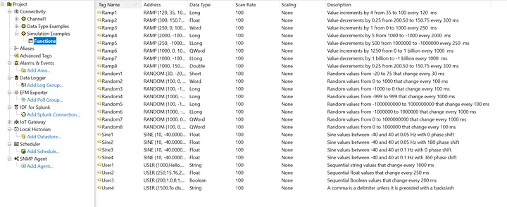

We now have an OPC server set up on our machine we are ready to tackle the cloud part. To win some time and space I’ll consider you already have your AWS account. Go to Services -> AWS IoT Core and click on the get started button, you should then be redirected to this welcome page.

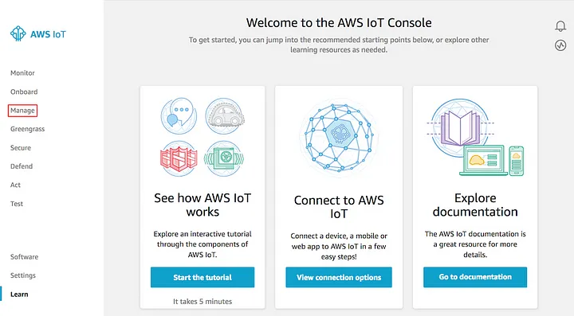

For the following part of setting up AWS IoT and Kepware certificates for MQTT communication, I point you to this fine how-to: https://steveunofficialguide.wordpress.com/sending-kepware-data-to-aws-iot-hub/

If you did everything alright and added some more tags to your IoT Gateway in Kepware like the simulated tags you should be able to do like me and use the Test interface from AWS IoT to look into the MQTT topic and see your tags being updated

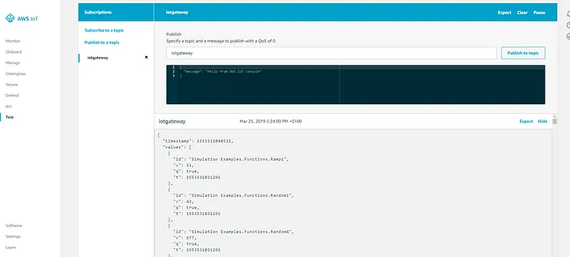

The next task is to set up a Kinesis stream for forwarding the opc tag values to the analytic component of our solution. Go to Services -> Kinesis -> Data Streams -> Create Kinesis stream

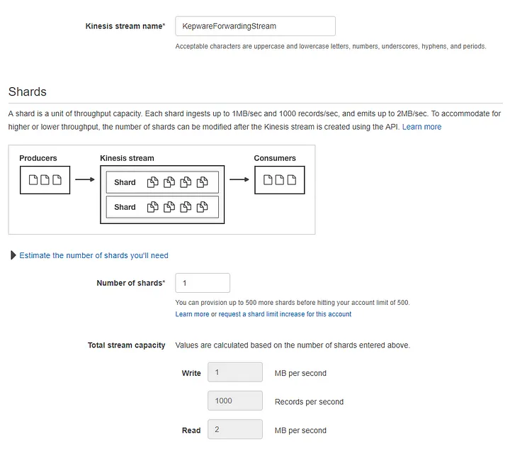

As this is just a demo let’s keep things simple and not talk about shard yet. Now that we have a Kinesis stream we can ask our IoT service to forward everything there.

We go back to AWS IoT Service -> Act -> Create a rule. Give you rule a name

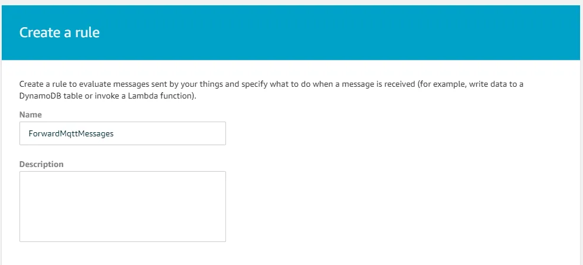

Give your rule a select statement, I kept it very generic because I have only a single opc tag forwarded but you can play around and filter your data before it gets to the analytic side of thing

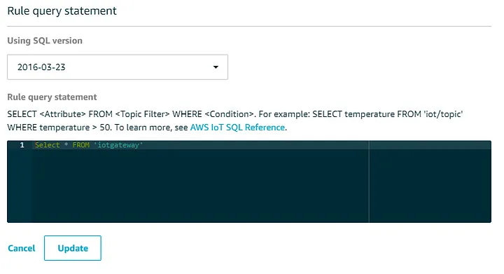

Now we will plug this action to our Kinesis stream, click on Add action button and select Kinesis stream, then find back your previously created stream

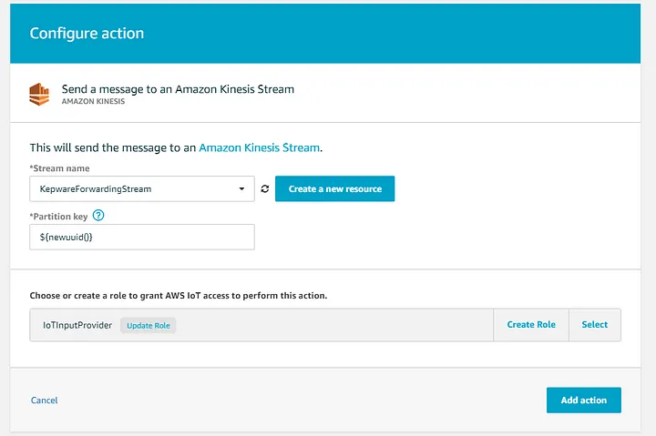

You can now complete the IoT rule creation. To see if you’re alright you can go to the Kinesis stream monitoring tab to see incoming messages from your kepware installation

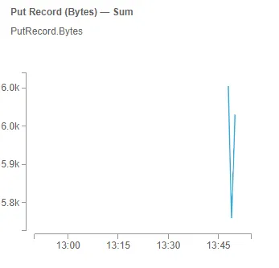

## Consuming the OPC tags and computing metrics

In the last section, we have set up our data flow from opc tags up to a Kinesis data stream. The data is there and is waiting for us to process it.

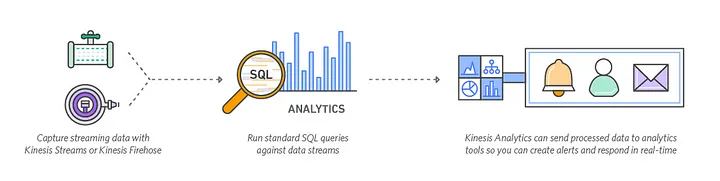

We will now process our opc tags and create some metrics over them, to later on, display those. To do so we will be using AWS Kinesis analytics. It lets you process your data streams using a SQL query like language with additional capabilities like the time windows that we will use.

But let’s first create our Kinesis analytics application.

Go to AWS -> Services -> Kinesis -> Data analytics -> Create applicaiton

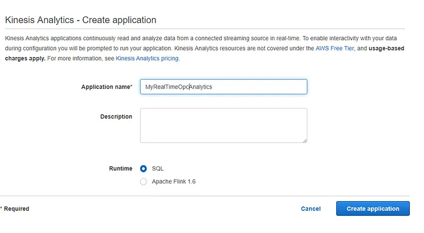

Your application is created and you can now setup you kinesis stream as an input for your analytics application

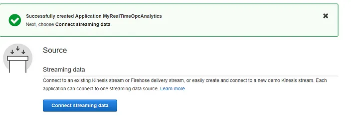

Select your stream as an input and leave everything else as is

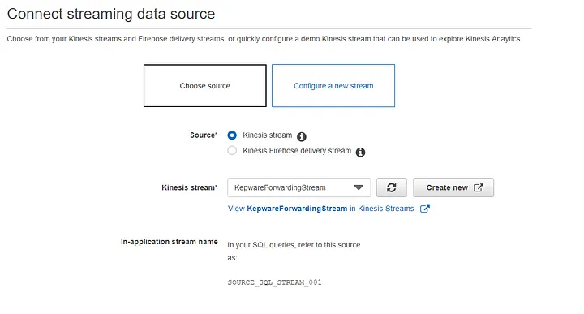

In the bottom of the page you will find a button to discover schema click on it and if you have enough data AWS will automatically deduct SQL schema from the MQTT messages

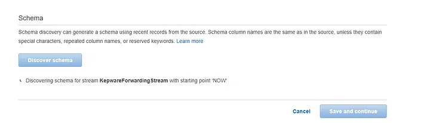

Once done AWS will show you a success message with a sample of your data once put into a tabular format

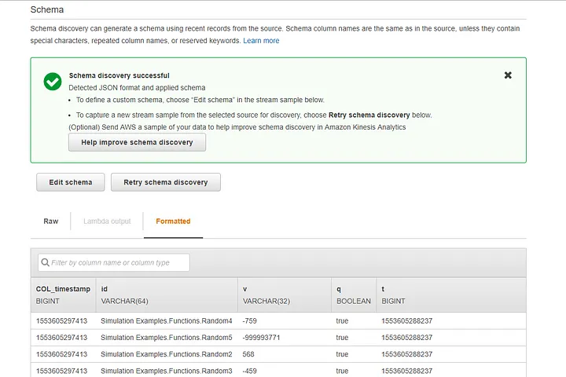

You can now save and continue, your data is there and the schema is ready to be acted upon we can now tackle the real analytic part of this setup

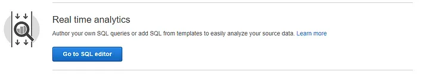

Click on the go to SQL editor section and start the application. AWS provides a nice set of SQL query samples over there that could let you compute most of your desired use cases. I could go over a lot of functionalities of this kinesis analytics service once there, but as I’m not yet an expert into I’ll leave it for another article. I have a lot of idea on how to use this tool but the most straight forward to me would be KPI computation like OEE or alerting over production line stop detecting the place where it stopped based on saturation bits

For this demo, I will limit myself to a simple average over the last 10 seconds over a tag simulating a sinus function. I can now click save and run and will get a glimpse into the generated result

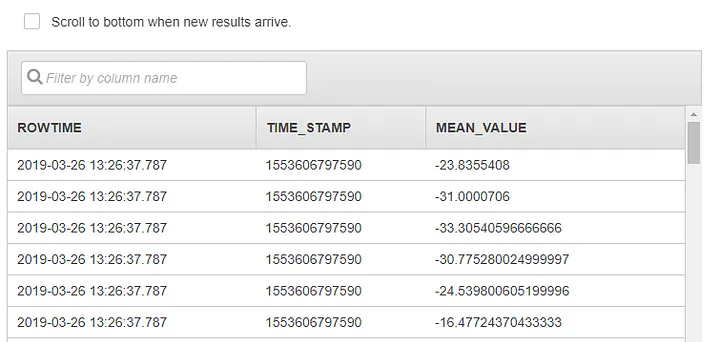

We are now done with setting up this 2nd part of the solution. We have data monitored through OPC that is passed in near real-time to our IoT Core which itself redirects it to a Kinesis Data Stream that gets processed by our Kinesis analytics platform.

That makes a lot of pipes to bring our data from one end to another, however as your solution would get more complex you would find benefits in going through all of this as you can redirect your data flow from one part to another and monitor all of them using AWS tooling.

## Provide real time dashboarding on top of your data

We now are about to complete the solution with a powerful and yet simple (and free)dashboarding solution called Kibana which is provided on top of elastic search.

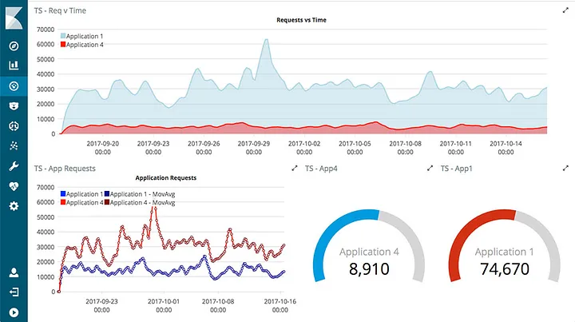

This is the type of dashboard we are aiming for, the goal of this last part that would allow us to go from opc tags to actual graphics that could be shared and displayed publicly.

But we still have a bit of configuration to complete like creating our Elasticsearch service. First go to services -> Elasticsearch -> Create a new domain.

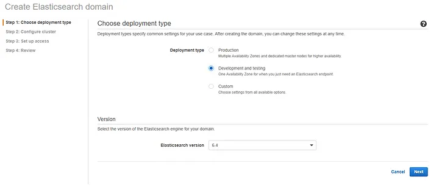

To keep things simple I went for a development and testing deployment, this also helps to keep the cost of this experiment down.

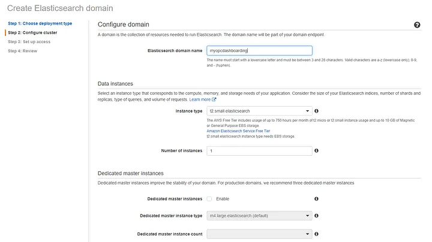

Give your domain a name and pick the right instance type, here I went for a t2.small instance again to keep cost low. You can of course play with larger data set and so set up a larger instance if needed. Keep the rest as is and click next. You will have to set the rest of the parameters for access yourself, you can of course set everything to the public if you run a short time experiment but this comes with a high risk as pointed out by amazon.

You can review your settings and confirm the Elasticsearch creation and go for a coffee as you wait for it to be up and running…

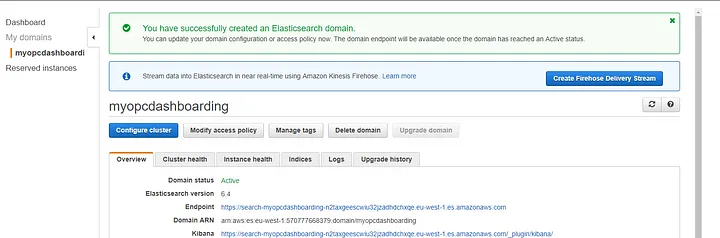

Once up and running you can click on the Create Firehose Delivery Stream button and once again on create delivery stream. Give you stream a name and leave everything as is until destination selection.

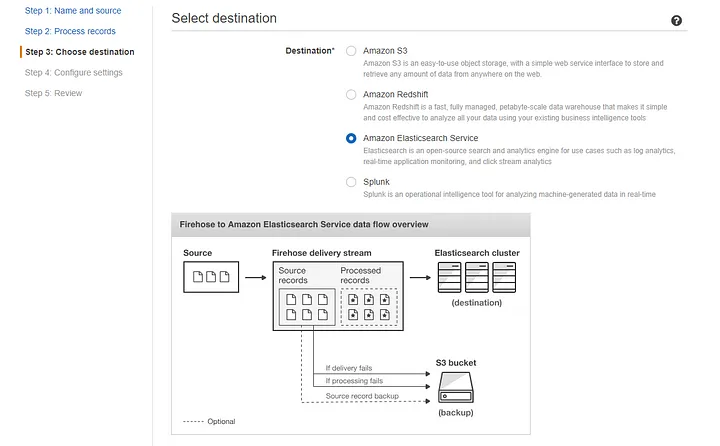

Select Elasticsearch service as a destination. You then need to select your previously created elasticsearch service an give an index name and type name

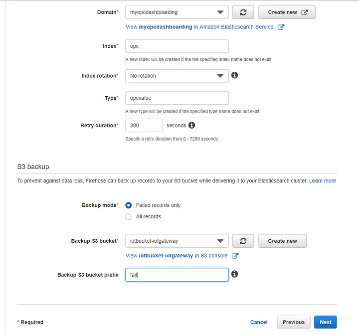

You will have to create also an S3 backup which will be used to save the failed records so that you could recover in case of error or bug in your application. Click next and create a new IAM role if needed then complete the firehose creation. Again it might take some time to complete but stay tuned, one more step and we can finally start the dashboarding work.

Now your elasticsearch is ready and your kinesis firehose also but no data is coming in yet, that’s why we will connect the Kinesis analytics to the firehose.

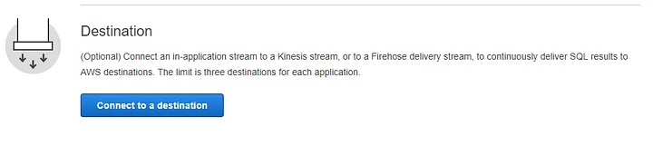

Go back to your kinesis analytics application and click on Connect to a destination.

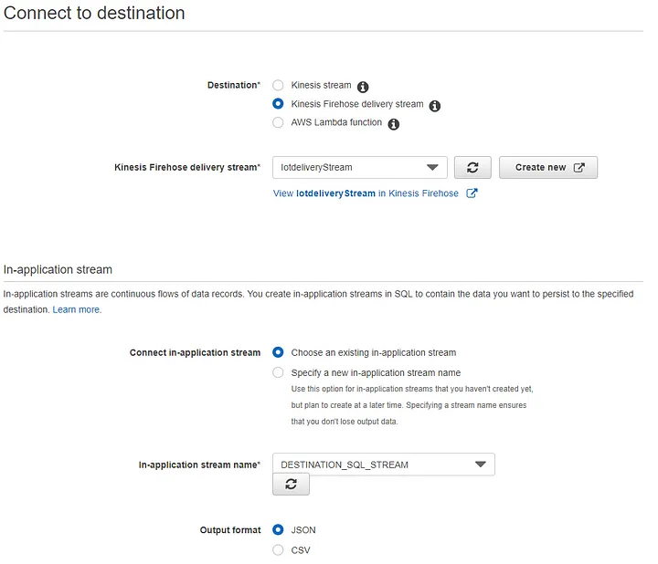

Setup the right firehose destination stream and your in-application stream which is the one created through the SQL query. Leave the rest as is and click on save and continue.

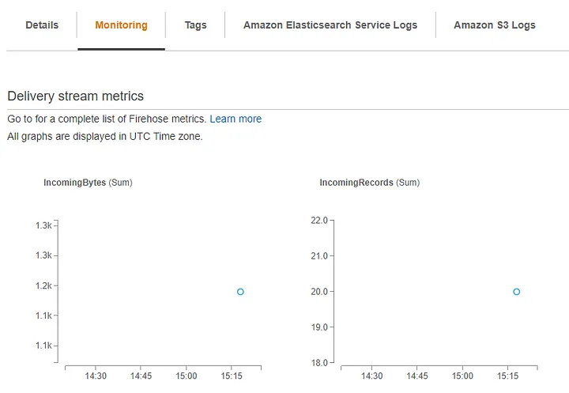

After some time you can go into your Kinesis firehose and the monitoring tab to see if data is flowing

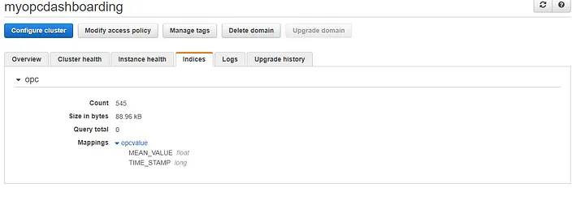

You can also check your elasticsearch service and the index you create, you should see that some data is there and that the structure has been detected.

We are now done with the AWS service setup and can finally grab the fruit of all our work and display those data. If you into your elasticsearch service you can find the Kibana link that we need to start setting the dashboards.

Once in go to management -> index pattern

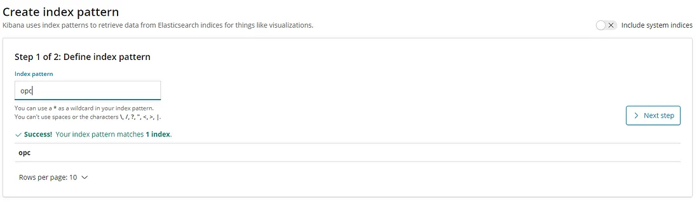

Let’s create our index pattern and let kibana detect our data type

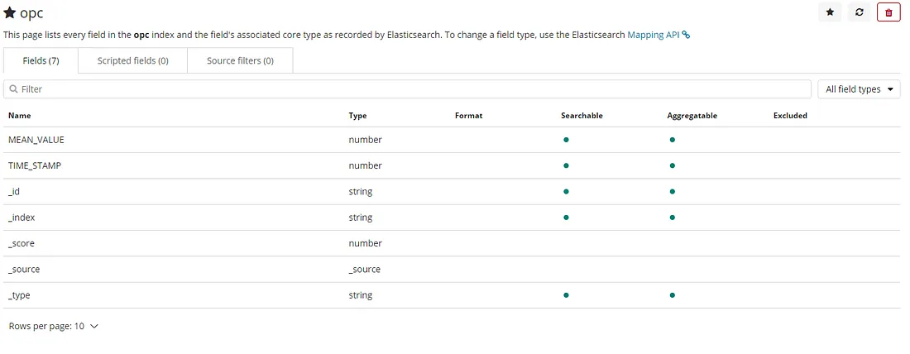

Your result should somehow look like above, we have yet a small thing to do and it’s setting a datetime field as for now we only have a Unix timestamp as a number.

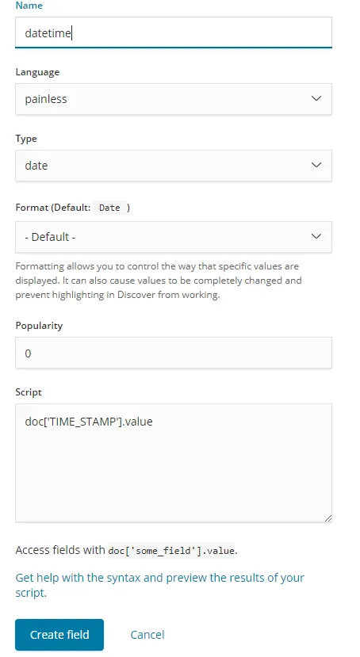

Go to the scripted field tab and configure your scripted field as above.

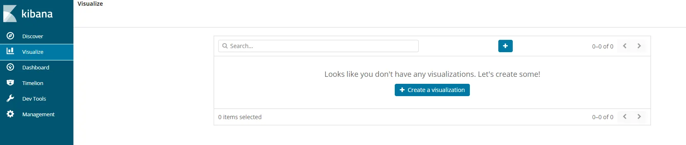
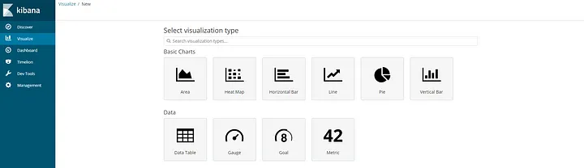

OK, time for some rendering. Go to visualize and create some visualization. Let’s first create a simple line chart and select the opc index.

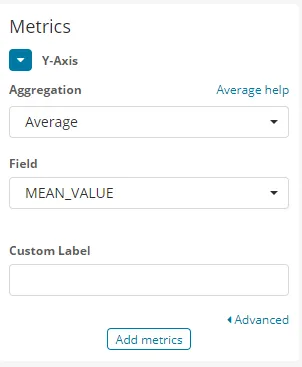

Configure your Y-axis as above and you X-axis as below

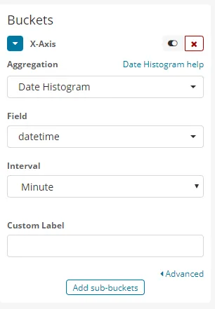

Click the run button and just enjoy your first near-real-time opc value visualization.

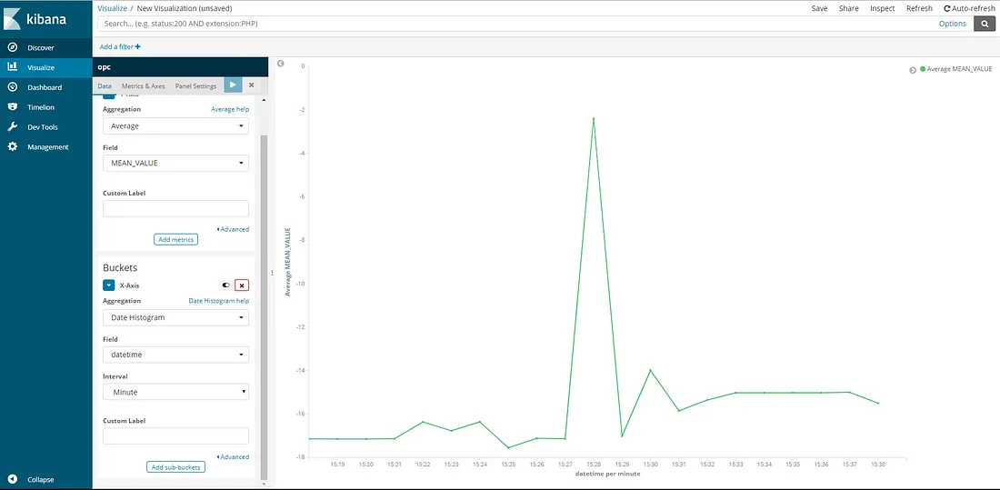

That was a long tutorial and we are only scratching the surface of what can be done here with Kibana and Kinesis Analytics. That could be a nice follow up if I find use cases internally in my company or outside who knows.