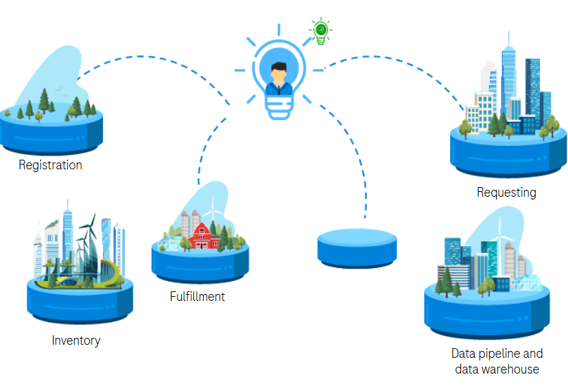

# Integrating the Research Application Landscape

A few months ago, I got the opportunity to present my work at [BioIT 2023](https://www.bio-itworldexpo.com/). I thought I'd share it back here in a written format in case it can benefit anyone.

## Introduction

One of the keys to research is the availability of information at the right time to support decision-making. This can obviously be achieved later when data is consolidated in data warehouses (or whatever new term we fancy for it), but some use cases *require* real-time data exchange.

This is usually where application integration comes in handy. However, it doesn't come without its challenges, which I will detail in the next few paragraphs. I'll also try to succinctly present the type of solutions we are working on to cope with the complexity inherent in integration.

## What does it mean to do an in vitro assay request

One of the system I have been working on is a requesting system for in vitro assays. This does seem pretty simple at first glance, but in big corporation the application landscape can be quite fragmented out of historical reason (acquisitions), by design or just as a consequence of the department bondaries that are bound to create disconnected landscapes ([Conway's Law](https://en.wikipedia.org/wiki/Conway%27s_law))

