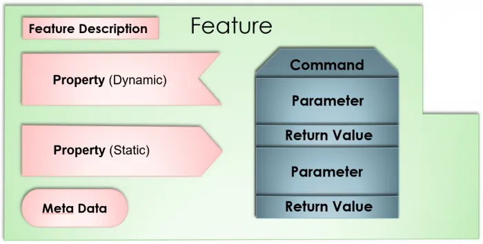
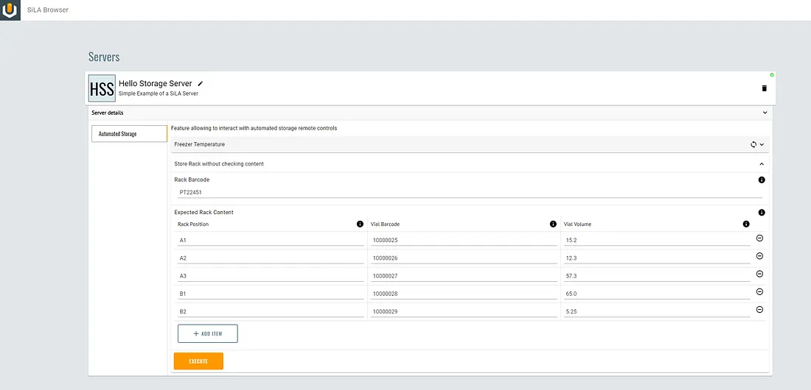

# SiLA 2 going fancy with features

If you have missed the introduction to SiLA 2 please have a look around here:
[SiLA 2 Hands-on](sila2_hands_on.md)


*This will be a more technical article but bear with me as you will gain deeper knowledge about what SiLA 2 is about. I would like to first thank UniteLabs for supporting me in writing this blog series.*

Want to skip all the talk and directly see a feature definition? go here

Features! If you should remember one new thing in SiLA 2 I would say that’s it. Features enable you :

to describe your equipment interface precisely
to automatically generate the backbone of your server
to standardize equipment interface over the industry

## What is a feature?


As abstract as this word may be, here we are talking about a well-defined behavior or ability of laboratory equipment. This image above shows all the components of a feature definition.

## Who can create it?
I would say describing a feature can be down given a minimal XML knowledge which is a human-readable data format.

Given the information that I will give you below and a simple text editor, you should be able to create your first SiLA 2 feature definition. I would still recommend having a more advanced editor like and IDE (integrated development environment) as it eases the writing of SiLA features with

## What makes a good feature definition?
What makes a good feature definition in SiLA 2 :

- self-described: all attributes parameters are defined within a feature definition enabling a complete understanding of input and output as well a resulting equipment behavior
- self-contained: a feature contains all commands, properties needed to execute what it was defined for
- abstract: The feature definition should be as much as possible vendor independent
- human-readable: feature description contains several name and description to enable the creation of a human-readable feature


## Getting started with your feature
### The feature definition
So let’s go back to my example throughout the article series on SiLA, the automated freezer.

``` xml
<?xml version="1.0" encoding="utf-8" ?>
<Feature SiLA2Version="0.1" FeatureVersion="1.0" Originator="org.silastandard" Category="examples"
         xmlns="http://www.sila-standard.org"
         xmlns:xsi="http://www.w3.org/2001/XMLSchema-instance"
         xsi:schemaLocation="http://www.sila-standard.org https://gitlab.com/SiLA2/sila_base/raw/master/schema/FeatureDefinition.xsd">
    <Identifier>AutomatedStorage</Identifier>
    <DisplayName>Automated Storage</DisplayName>
    <Description>Feature allowing to interact with automated storage remote controls</Description>
    
         ...
         
</Feature>
```

Above you can see the first three properties to enter to define your feature :

- the feature version
- originator: who is providing this feature
- category: a tagging property to help you organize the features you create

Then we have the three fields to be entered :

- the identifier which will be used to reference your feature on a programmatic level and is exchanged between client and server to call a feature
- the display name which gives you a human-readable text to display
- the description which provides insight on what the feature can do

### The command
Inside our “AutomatedStorage” feature we want to have different commands to store or retrieve rack and vials.

Here like with the feature we need to provide an identifier, a display name, and a description.

``` xml
<Command>
        <Identifier>StoreRackWithNoContentCheck</Identifier>
        <DisplayName>Store Rack without checking content</DisplayName>
        <Description>Store a rack without checking for its content in term of mapping of tubes position</Description>
        <Observable>No</Observable>
        <Parameter>
            ...
        </Parameter>
         <Response>
            ...
        </Response>
</Command>
```

The additional field which is of interest here is “Observable” this important tag is used to define if your command is streaming data while executing like a temperature curve or a status update back to the client after starting the execution.

### The parameters

The parameters are used to further describe the command and what is needed in terms of input to have the command perform the described behavior. This is where we reach the data structure definitions which are quite powerful within the FDL (Feature Definition Language) of SiLA.

But first, let see how to input a simple parameter like a string or decimal value.

``` xml 
<Command>
    ...
    <Parameter>
        <Identifier>RackBarcode</Identifier>
        <DisplayName>Rack Barcode</DisplayName>
        <Description>The barcode of the rack that will be inserted into the automated freezer</Description>
        <DataType>
            <Basic>String</Basic>
        </DataType>
    </Parameter>
    <Parameter>
        <Identifier>RackHeight</Identifier>
        <DisplayName>Rack Height</DisplayName>
        <Description>The height of the rack that will be inserted</Description>
        <DataType>
            <Basic>Real</Basic>
        </DataType>
    </Parameter>
  </Command>
```
As we have seen for the feature and command there is some basic field required. The additional one I want to drive your attention to is the DataType tag, this is where we define the type of data that will be passed to the command and in some cases a complex structure.

Here we are making use of the basic data types that are available in SiLA, if you use an IDE has advised above you should have auto-completion for it otherwise here is the list of available types: Real, Boolean, Date, Integer, SmallBinary, String, Time, Timestamp.

You can already do a lot with those, for most simple devices like readers or scales and sensors, this would be sufficient. However, in our automated freezer use case, we might want to pass a list of expected vials that should be in a rack, and for this, we need the other data types that are available.

``` xml
<Command>
    ...
    <Parameter>
        <Identifier>ExpectedRackContent</Identifier>
        <DisplayName>Expected Rack Content</DisplayName>
        <Description>The vials barcode and position which are expected within the rack</Description>
        <DataType>
            <List>
                <DataType>
                    <Structure>
                        <Element>
                            <Identifier>RackPosition</Identifier>
                            <DisplayName>Rack Position</DisplayName>
                            <Description>A cell within a rack</Description>
                            <DataType>
                                <Basic>String</Basic>
                            </DataType>
                        </Element>
                        <Element>
                            <Identifier>VialBarcode</Identifier>
                            <DisplayName>Vial Barcode</DisplayName>
                            <Description>the barcode of the vial within the rack position given</Description>
                            <DataType>
                                <Basic>String</Basic>
                            </DataType>
                        </Element>
                        <Element>
                            <Identifier>VialVolume</Identifier>
                            <DisplayName>Vial Volume</DisplayName>
                            <Description>The volume of material within the Vial in ml</Description>
                            <DataType>
                                <Basic>String</Basic>
                            </DataType>
                        </Element>
                    </Structure>
                </DataType>
            </List>
        </DataType>
    </Parameter>
</Command>
```

In the example above you can see what a more advanced use case of the parameter might look like. For developers, these structures would seem familiar as the List and Structure elements are quite similar to lists and classes in programming languages and that’s what SiLA would translate those structures too.

What is important to get out of this example is that you won’t be limited by the SiLA command parameter definition and you can structure them as you want to model the data that you need to input into your command.

### The responses
In SiLA the responses do work similarly to the parameters and there can be multiple response structures possible from one command. I won’t detail how to create those as they are quite similar to parameters and you can reuse the knowledge above to create them.

### The properties
Outside of the commands which are your interactive entry point to communicate with the SiLA server you might find it interesting to define properties to your feature. In our example, the temperature of the automated Freezer would be a nice value to be able to monitor.

### Building reusable types
To be able to have a cleaner feature you can use data type definition, those allow you to have a predefined data structure which will be shared across your features and commands thus allowing you to reuse some of your underlying components and have a more object-oriented approach to SiLA2

``` xml
<DataTypeDefinition>
      <Identifier>Rack</Identifier>
      <DisplayName>Rack</DisplayName>
      <Description>Rack entity containing containers </Description>
      <DataType>
          ...
      </DataType>
</DataTypeDefinition>
```

Once you have created this DataTypeDefinition in your feature you can simply call it in a command like below

``` xml
<Command>
    ...
    <Parameter>
        ...
        <DataType>
            <DataTypeIdentifier>Rack</DataTypeIdentifier>
        </DataType>
    </Parameter>
    ...
</Command>
```

## Experimenting with it
Once again I can spin up my favorite SiLA Browser provided by UniteLabs and start also my server



## Wrapping up

Look at the final feature definition to remember the important feature element we have discovered today

``` xml
<?xml version="1.0" encoding="utf-8" ?>
<Feature SiLA2Version="0.1" FeatureVersion="1.0" Originator="org.silastandard" Category="examples"
         xmlns="http://www.sila-standard.org"
         xmlns:xsi="http://www.w3.org/2001/XMLSchema-instance"
         xsi:schemaLocation="http://www.sila-standard.org https://gitlab.com/SiLA2/sila_base/raw/master/schema/FeatureDefinition.xsd">
    <Identifier>AutomatedStorage</Identifier>
    <DisplayName>Automated Storage</DisplayName>
    <Description>Feature allowing to interact with automated storage remote controls</Description>

    <DataTypeDefinition>
        <Identifier>RackContent</Identifier>
        <DisplayName>Rack Content</DisplayName>
        <Description>Rack entity containing containers with their location</Description>
        <DataType>
            <Structure>
                <Element>
                    <Identifier>RackPosition</Identifier>
                    <DisplayName>Rack Position</DisplayName>
                    <Description>A cell within a rack</Description>
                    <DataType>
                        <Basic>String</Basic>
                    </DataType>
                </Element>
                <Element>
                    <Identifier>VialBarcode</Identifier>
                    <DisplayName>Vial Barcode</DisplayName>
                    <Description>the barcode of the vial within the rack position given</Description>
                    <DataType>
                        <Basic>String</Basic>
                    </DataType>
                </Element>
                <Element>
                    <Identifier>VialVolume</Identifier>
                    <DisplayName>Vial Volume</DisplayName>
                    <Description>The volume of material within the Vial in ml</Description>
                    <DataType>
                        <Basic>String</Basic>
                    </DataType>
                </Element>
            </Structure>
        </DataType>
    </DataTypeDefinition>
    
    <Command>
        <Identifier>StoreRackWithNoContentCheck</Identifier>
        <DisplayName>Store Rack without checking content</DisplayName>
        <Description>Store a rack without checking for its content in term of mapping of tubes position</Description>
        <Observable>No</Observable>
        <Parameter>
            <Identifier>RackBarcode</Identifier>
            <DisplayName>Rack Barcode</DisplayName>
            <Description>The barcode of the rack that will be inserted into the automated freezer</Description>
            <DataType>
                <Basic>String</Basic>
            </DataType>
        </Parameter>
        <Parameter>
            <Identifier>ExpectedRackContent</Identifier>
            <DisplayName>Expected Rack Content</DisplayName>
            <Description>The vials barcode and position which are expected within the rack</Description>
            <DataType>
                <DataTypeIdentifier>RackContent</DataTypeIdentifier>
            </DataType>
        </Parameter>
        <Response>
            <Identifier>ActualRackContent</Identifier>
            <DisplayName>Actual Rack Content</DisplayName>
            <Description>Content of the rack with location and barcode of vials inside</Description>
            <DataType>
                <DataTypeIdentifier>RackContent</DataTypeIdentifier>
            </DataType>
        </Response>
    </Command>
    
    

    <Property>
        <Identifier>FreezerTemperature</Identifier>
        <DisplayName>Freezer Temperature</DisplayName>
        <Description>The current temperature of the freezer</Description>
        <DataType>
            <Basic>Real</Basic>
        </DataType>
        <Observable>Yes</Observable>
    </Property>

</Feature>
```

You should now have a better understanding of this feature definition language SiLA is using, it should cover many use cases we might think of. I have a small exception in mind for binary data which needs to be loaded as such because of the volume or architecture of the underlying instruments.

There is more to explore in the SiLA repository mentioned as a link below, for example, the SmallBinary data type could fill some of the use cases mentioned just before.

I now need to get further into the server implementation and will probably pick up an existing automated freezer like a Liconic or Arktic storage which I’m working on and will provide a wrapper for those so that it can be tested in the labs.

## Useful Links


[Sila2 Website](https://sila-standard.com)

[Sila2 Repository](https://gitlab.com/SiLA2)
