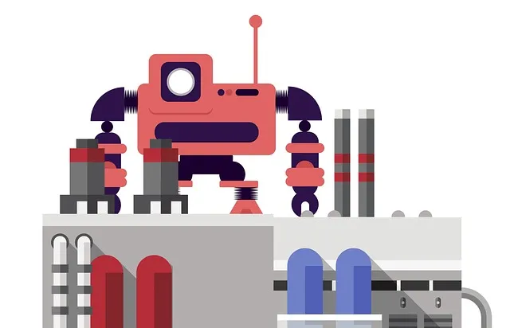
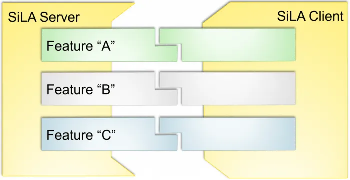
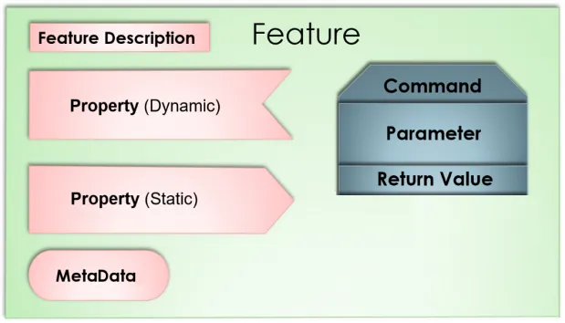

# SiLA 2 hands on : bringing automation to the laboratory

Ever heard about SiLA ? It stands for Standard in Lab Automation, and if you’re not working in automation of life science laboratories, you are probably hearing about this for the first time. In this blog post I will introduce you the benefits of SiLA 2 (the latest version of the standard) and show a hands-on example how the standard can help and simplify laboratory equipment integration into your IT systems.



       

## Let’s set the scene
In a perfect world all your equipment would provide the same way of controlling the functions and accessing the data. Integrating the equipment into your IT landscape would become both consistent and less tedious.

Sadly, until now, several issues may occur :
<!-- more -->

- Your equipment was not designed to be integrated into any IT system and you are left with no choice than to live with it or purchase new equipment
- Your equipment has some kind of interface but very few of its capacities are exposed to interact with. You may not even be able to extract the data it produces
- In the best case, you have a set of integration points covering most of the device functionalities, well documented and written in modern, non-proprietary language
- Unfortunately, even if you reach the best case scenario you would still have to write a custom piece of software for each and every equipment you have. It would result in a huge library of disparate implementations for various equipment with no common ground.

## Solving the integration issues with SiLA 2
SiLA 2 is a communication standard for laboratory instruments, such as readers, liquid handling robots and chromatography and other analytical equipment. However, with the new 2nd version of SiLA, it can also be used as a communication protocol between any microservices, even completely virtual. This makes it possible to track, monitor and even remote control assets, which makes it also capable in manufacturing use cases.

Additionally, the SiLA 2 standard is self descriptive, which means that by connecting to the interface, you or any software could learn exactly what the device can do and how to use it. This makes it possible to create software tools that can readily operate any SiLA 2 supported instrument without drivers or configurations.

## Client - Server concept
It is based on a client — server communication model where the server exposes it’s capabilities to all clients in a consistent way. The interactions with the server (e.g. an incubator) are grouped into SiLA Features. Each Feature (e.g. shaking or temperature control) encompasses commands and data outlets related to the same instrument capability.




## Feature definitions
Servers can implement a set of features that the client can use selectively based on the use case. The client could be a LIMS system, requesting system or an inventory management system. Even another lab instrument could be a client to communicate to the next device in the lab workflow, thus enabling device to device communication, robotic integration and closed-loop feedback. One example would be a scale asking a barcode reader the ID of the current sample and humidity from a sensor to associate with the weight measurement.




The features of a device (that is, a SiLA server) are described using an XML file where the functionality is described using:

Properties: data values that can be static (e.g. serial number) or dynamic (e.g. current temperature)
Commands: an interaction to control or pass information to/from the SiLA Server
Parameters: expected information required to execute the command
Return values: expected output of the command
Errors: expected errors that might occur during the operation
For example you could have an automated freezer with a tube storage feature with a “Get tube”command that takes a parameter “Tube IDs” as list a of strings and as returns the “Destination” as a position of the tubes on the output rack.

# Automated server and feature discovery
The SiLA protocol also comes with a zero configuration discovery service which allows a client to broadcast a message to discover all available servers and their associated features. This is the perfect match if you are in a very dynamic environment where instruments are often relocated from one system or laboratory to another.

# And many more…
The SiLA standard defines many more capabilities but it also standardized features so that all providers could stick to the same common commands and interactions. Examples of further capabilities provided by SiLA 2:

Data types and transport
Encryption and authentication
Property subscription
Command progress updates
Instrument locking etc.
There’s a lot to explore with SiLA 2 and I have included links in the end of the article for you to read more. Now that we are familiar with the basic SiLA 2 concepts, let’s get our hands on the SiLA protocol. We are going to implement the automated storage as an example to see how it works in practice.

## Building a simple storage system SiLA 2 driver
There are many tools and examples available in the SiLA 2 repository that help new developers get started. For instance, I’ll start developing the automated storage server from the hello_sila example project and modify it to fit my needs. The full code for this example is available here : https://github.com/mcroissant/sila_simple_storage

The follow up section may be technical and Java focused but you can find many resources for other languages directly on the SiLA 2 repositories : https://gitlab.com/SiLA2

### Creating a feature
The first step in developing a SiLA 2 server is to create the feature definition which all server-client interactions will be based.

Our feature contains a simple command with no response and a simple parameter. The interactions could of course get more sophisticated using structures and more complex return values, but that will be a story for the next article.

``` xml
<?xml version="1.0" encoding="utf-8" ?>
<Feature SiLA2Version="0.1" FeatureVersion="1.0" Originator="org.silastandard" Category="examples"
         xmlns="http://www.sila-standard.org"
         xmlns:xsi="http://www.w3.org/2001/XMLSchema-instance"
         xsi:schemaLocation="http://www.sila-standard.org https://gitlab.com/SiLA2/sila_base/raw/master/schema/FeatureDefinition.xsd">
    <Identifier>AutomatedStorage</Identifier>
    <DisplayName>Automated Storage</DisplayName>
    <Description>Feature allowing to interact with automated storage remote controls</Description>
    <Command>
        <Identifier>StoreRackWithNoContentCheck</Identifier>
        <DisplayName>Store Rack without checking content</DisplayName>
        <Description>Store a rack without checking for its content in term of mapping of tubes position</Description>
        <Observable>No</Observable>
        <Parameter>
            <Identifier>RackBarcode</Identifier>
            <DisplayName>Rack Barcode</DisplayName>
            <Description>The barcode of the rack that will be inserted into the automated freezer</Description>
            <DataType>
                <Basic>String</Basic>
            </DataType>
        </Parameter>
    </Command>
</Feature>
```


As you can see feature definition are self explanatory files written in a comprehensive XML format. The feature file will be validated and further used to generate the exchanged messages between server and client.

### Adding the feature to the server
Adding a feature to a server is relatively easy and is a one line as you can see just below. From now on our server would expose this as one of its features and advertise it to clients asking what the server is capable of.


``` java
  builder.addFeature(
      "org.silastandard/examples/v1/AutomatedStorage",
      getResourceContent("AutomatedStorage.sila.xml"),
      new AutomatedStorageImpl()
);
```

### Implementing the feature
As the base of the feature as already been generated automatically by the SiLA protocol what’s left for us to do is to extend the functionality of this base implementation. If you want to know more about the automated code generation please leave a comment on this could be an interesting starting point for the following article.

The example below shows what the minimum implementation could look like with input parameter validation and error responses as well as response construction.

``` java
package sila_java.servers.automated_freezer.automated_storage;

import sila2.org.silastandard.examples.automatedstorage.v1.AutomatedStorageGrpc;
import sila2.org.silastandard.examples.automatedstorage.v1.AutomatedStorageOuterClass;
import sila_java.library.core.sila.types.SiLAErrors;

public class AutomatedStorageImpl extends AutomatedStorageGrpc.AutomatedStorageImplBase{

    /**
     */
    @Override
    public void storeRackWithNoContentCheck(sila2.org.silastandard.examples.automatedstorage.v1.AutomatedStorageOuterClass.StoreRackWithNoContentCheck_Parameters request,
                                            io.grpc.stub.StreamObserver<sila2.org.silastandard.examples.automatedstorage.v1.AutomatedStorageOuterClass.StoreRackWithNoContentCheck_Responses> responseObserver) {


        /*
        Different parameters can be checked, it is mandatory to throw Validation Errors in case of
        missing parameters, which will be done automatically in the future.
        */
        if (!request.hasRackBarcode()) {
            responseObserver.onError(SiLAErrors.generateValidationError(
                    "Rack Barcode",
                    "Rack barcode parameter was not set",
                    "Specify a barcode with at least one character"));
            return;
        }

        /**
         * TODO implement any behaviour needed on the server side for the equipment
         */

        AutomatedStorageOuterClass.StoreRackWithNoContentCheck_Responses result =
                AutomatedStorageOuterClass.StoreRackWithNoContentCheck_Responses
                        .newBuilder()
                        .build();

        responseObserver.onNext(result);
        responseObserver.onCompleted();

    }
}
```

### Launching our server
Once our server is compiled and launched we can use a free tool provided by UniteLabs allowing our browser to act as a SiLA client you can download it freely here : [link](https://unitelabs.ch/technology/plug-and-play/try-it-out?utm_source=medium&utm_medium=content&utm_campaign=matthieu_croissant)


Automatically created interface of our server feature within SiLA Browser
From there we could directly control our automated storage and tell it to store a given rack. This interface is quite useful for development and debugging but as stated before you would probably integrate your freezer directly with an other system like your inventory or your LIMS.

## Wrapping up
We have just scratched the surface of the SiLA 2 protocol and it is very promising as the manufacturer adoption is rising we will be able to leverage the benefits of it and integrate new equipment faster and in a more consistent way.

I am writing another article on the subject and will provide a full fledged implementation of the automated storage case so that it can serve as a demo. Let me know if you are interested.

## Want to know more on SiLA ?