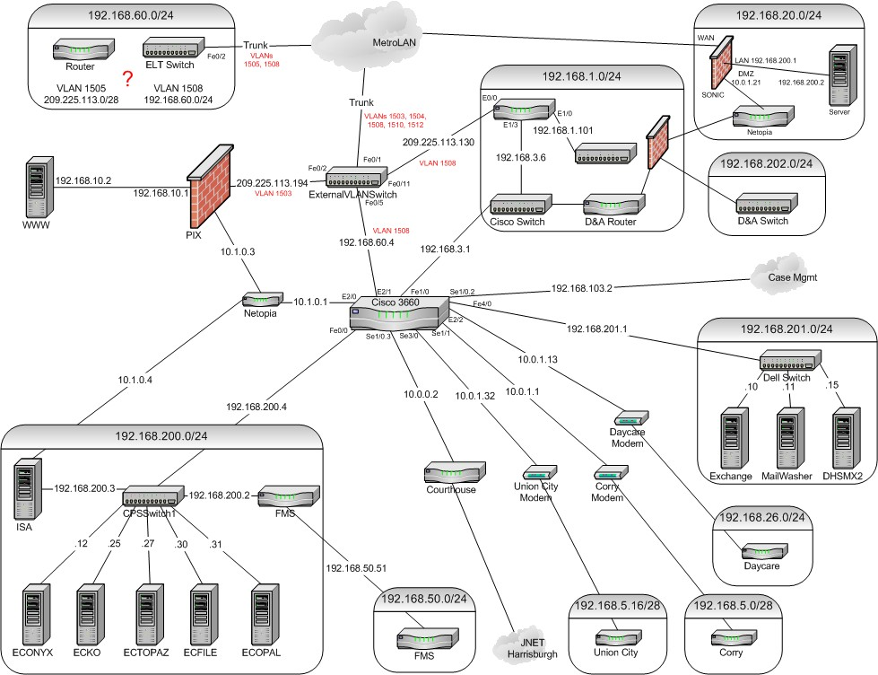

# Networking Basics


## What Is a Network?
A **network** is an interconnected set of devices or computers designed to communicate and share resources with each other or devices to share resources and exchange data. Networks can range from a simple connection between two devices to vast, global systems like the internet.



#### Examples:
- The **Internet** is the largest and most well-known network.
- A **home network** connects personal devices like laptops, phones, and printers.
- **Corporate networks** allow employees to share resources within an organization.
- **Manufacturing network** companies might run multiple networks within them for specific needs like bandwith of security, this is usually the case for factories that needs to separate their corporate network from their manufacturing devices for security reason.

#### Key Components:

- **Nodes**: Devices such as computers, servers, and smartphones that are part of a network.
- **Links**: The physical or wireless pathways connecting devices.
- **Topology**: The arrangement or structure of a network, such as star, mesh, or bus.
- **Protocols**: Rules that govern how data is transmitted, such as HTTP, FTP, and TCP/IP.


!!! try-it
    Networks can be way more complex than we think, try running the following command (might require to install it if not already done)

    ```bash
    traceroute google.com
    ```

    Here you will find the amount of "hops" you query made before reaching Google servers.

    ```bash
    ....
    ....
    ...

    ```

---

## Key Networking Concepts

### Network types

#### LAN (Local Area Network)
#### WAN (Wide Area Network)


### Network devices


### IP Address
An **IP address** is a unique identifier assigned to each device on a network, similar to a phone number for humans. It ensures that data is sent to the correct destination. Think of an IP address as a postal address for your device; it tells the network where to deliver data.

#### Types of IP Addresses:
1. **IPv4:** Format: `192.168.1.1` (limited pool of addresses).
2. **IPv6:** Format: `2001:0db8:85a3:0000:0000:8a2e:0370:7334` (designed to solve the IPv4 exhaustion issue).

#### Private vs Public addresses


### Domain Name System (DNS)
The **DNS** translates human-readable domain names (e.g., `api.example.com`) into machine-readable IP addresses (e.g., `192.168.1.1`).

#### Analogy:
The DNS is like a phonebook for the internet, converting names into numbers.

#### Key Components:
- **Resolvers:** Translate domain names into IP addresses.
- **DNS Records:** Store information about a domain (e.g., A, AAAA, CNAME).

### Ports
Ports are logical channels that identify specific processes or services running on a device.

#### Examples:
- **Port 80:** HTTP traffic.
- **Port 443:** HTTPS traffic.
- **Port 22:** Secure Shell (SSH) connections.

### Protocols
#### HTTP/HTTPS
- **HTTP (Hypertext Transfer Protocol):** Foundation for data exchange on the web.
- **HTTPS:** Secure version of HTTP, using encryption for safe data transmission.

#### TCP/IP
- **TCP (Transmission Control Protocol):** Ensures data packets arrive accurately and in order.
- **IP (Internet Protocol):** Handles addressing and routing of packets.

---

## Common Network Layers in an API Call

### Simplified OSI Model for API Beginners:
1. **Application Layer:** Where APIs operate using protocols like HTTP/HTTPS.
2. **Transport Layer:** Ensures reliable data transfer using TCP.
3. **Network Layer:** Handles addressing and routing through IP.

#### Analogy:
Think of these layers as a package delivery system:
- Application Layer: Preparing the package.
- Transport Layer: Ensuring it arrives intact.
- Network Layer: Choosing the best route for delivery.

---

## How Data Travels Over the Internet

### The Request-Response Cycle
1. **Client Request:** The client sends an HTTP request to a server.
2. **Server Processing:** The server processes the request.
3. **Server Response:** The server sends an HTTP response back to the client.

### Breaking Down a URL
Example: `https://api.example.com/resource?id=123`
- **Protocol:** `https://` (defines how data is transmitted securely).
- **Domain:** `api.example.com` (the server’s address).
- **Path:** `/resource` (specific resource on the server).
- **Query Parameters:** `?id=123` (additional data for the request).

---

## Challenges in Networking

### Latency
The time delay between sending a request and receiving a response.

### Packet Loss
Data packets failing to reach their destination, often due to network congestion.

### Firewalls
Devices or software that block unauthorized access or certain types of requests.

### Security Risks
Potential issues like eavesdropping, man-in-the-middle attacks, and data breaches. Encryption via HTTPS mitigates many of these risks.

---

## Hands-On Activity

### Visualizing the Request-Response Cycle
1. Use tools like **Postman** or **curl** to make an API call (e.g., a GET request).
2. Observe the following:
   - **Headers:** Metadata about the request and response.
   - **Status Codes:** Indicate the outcome (e.g., 200 OK, 404 Not Found).
   - **Response Body:** The actual data returned by the server.

### Exploring Network Activity
1. Open your browser’s developer tools.
2. Navigate to the **Network** tab.
3. Monitor API requests and responses as you interact with a web application.

---

## Practical Tips for Debugging Network Issues

### Ping a Server
Test connectivity by using the `ping` command to send packets to a server and measure the response time.

### Trace the Route
Trace the path data takes to reach a server using:
- `tracert` (Windows).
- `traceroute` (Linux/Mac).

### Inspect DNS Issues
Use tools like `nslookup` or `dig` to check DNS resolution and troubleshoot domain-related problems.

---

## Summary

### Key Takeaways:
1. Networks connect clients and servers to share data and resources.
2. Core components like IP addresses, DNS, and ports are essential to networking.
3. Protocols like HTTP/HTTPS and TCP/IP govern communication.
4. Tools like Postman and browser developer tools can help visualize and debug API requests.
5. Understanding networking basics is crucial for effective API development and troubleshooting.

