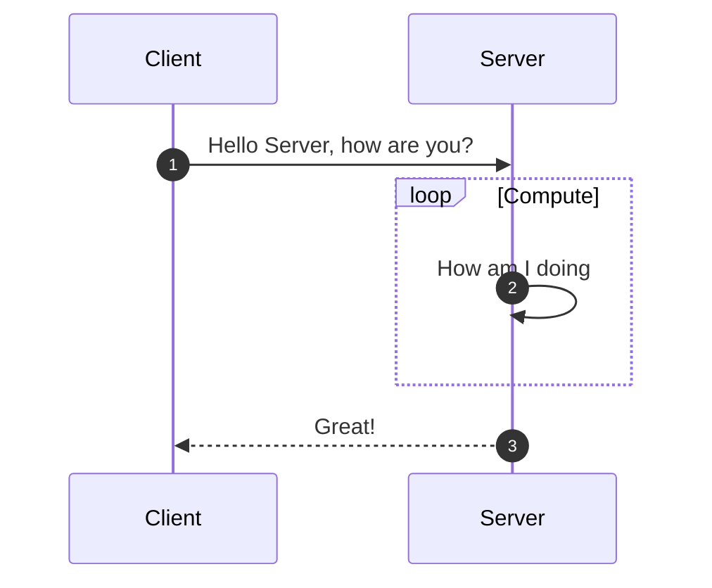
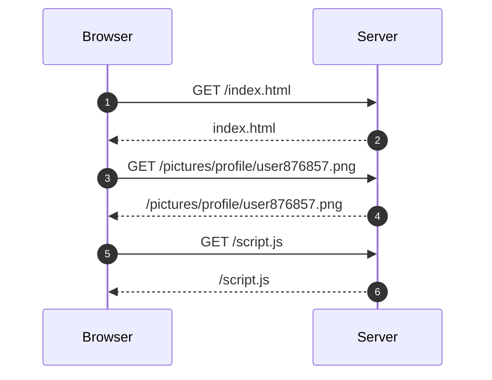
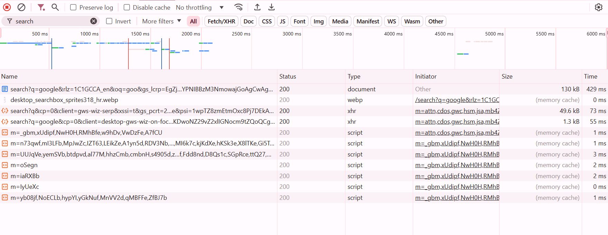

# Client-server paradigm

## What is a client server interaction

This basic interaction is based on requests and responses being exchanged between the client and the server. The client is usually the one initiating the interaction with the server knowing in advance how to contact it.

The interaction between the client and the server is most of the time supported by an underlying network layer even if this is not a pre-requisites as this concept could be used inside of a single system.

### Client

Clients are devices or applications that request services or resources from a server. The most common client that everyone know being web browsers, mobile apps or just any kind of software in general.

What distinguisheds the client from the server is the fact that it is the one to initiate the transaction and process the response. 

In more complex use cases like Internet of Things (IoT) clients can also be servers which enables device to device communications. You could think of a communication between cars on the road to exchange traffic condition as an example of this.

### Server

A server is a system or application that provides  resources, data, or services to clients. Here you should not understand it in the sense of the physical server even though this is where the name is derived from.

The server is a software piece offering something of value to the client upon request. Servers can handle multiple client requests simultaneously and require more computing power than the client application.

## Client server communication protocols

Client server exchanges can be very diverse in their use cases. To support such diversity the industry has come up with a variety of different protocols with their specificities.

Here is a short list of them : 

- [HTTP](02_http.md) (HyperText Transfer Protocol) : used by web pages and services, rest apis

- FTP (File Transfer Protocol) : used for file transfers to and from servers

- SMTP (Simple Mail Transfer Protocol) : specific to email servers and clients

- TCP/IP (Transmission Control Protocol / Internet Protocol) : lower level of protocol reused by others like HTTP and FTP

- UDP (User Datagram Protocol) : leveraged by streaming services and online gaming, mostly real time use cases

- and many more..

## Example : Web browsing

The above sequence shows a simplified view on what is hapenning in your browser whenever you open a website : 

1. Your browser asks for a given webpage to the server
2. The Server returns the web page to you

    Html web pages are often containing references to other resources that need to be loaded for the page to be displayed, this can be images, scripts that will be executed in your browser and other type of resources.
3. You browser is now requesting other resources that are required by the page like the user picture
4. Server return the picture
5. You browser requests a javascript file most likely containing some dynamic behavior the page will have
6. The server returns the required script

These interactions will continue on and on until enough resources have been exchanged for the page to start loading, those are called synchronuous loading as the web page is not starting to be rendered until those resources are returned. This can lead to long loading time and that's why most modern web pages implement some asynchronuous loading behaviors to reduce the time necessary for the page to start to display. 

!!! try-it
    Try opening the developer tools in your browser.

    You'll be able to check the behavior of every site you are opening and see how the different resources that are in your web page are being loaded.

    Ctrl+Shift+I in Chrome
    <figure markdown="span">
        
        <figcaption>Chrome Developer tools network tab</figcaption>
    </figure>
